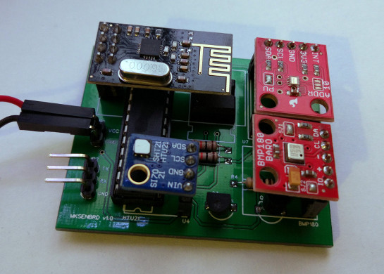

Simple wireless sensor system
=============================

As a part of home automation system for my house, I have designed a wireless sensors system that can continuously
monitor temperature, humidity, light and atmospheric pressure of multiple spots in the building.

This repository contains all elements required to build your own wireless sensor system based on ATmega328P, 
Raspberry PI and NRF24L01:

| Directory                          | Description                                            |
|------------------------------------|--------------------------------------------------------|
| [board](./board)                   | Schematic and PCB design of wireless sensor module     |
| [firmware](./firmware)             | Arduino-compatible firmware for wireless sensor module |
| [example-server](./example-server) | Simple wireless sensors server for Raspberry PI        | 

Case study
----------

As I mentioned, this wireless sensor system is a part of home automation system for my house.
At the moment, I have five wireless sensors connected to it. Each sensor module sends new readings in 16 seconds 
intervals and is powered by 3xAA rechargeable batteries - it is enough to power the module for over **2 months**. 
Power consumption is **~0.05 mA** in sleep mode and **20-30 mA** while measurements.  

**Cost of single module**

| Item                      | Price  | Note                                                                  |
|---------------------------|--------|-----------------------------------------------------------------------|
| PCB                       | $0.88  | ... if you order 20 PCB from EasyEDA (does not include shipping cost) |
| ATmega328P                | $1.23* |                                                                       |
| LD1117AV33                | $0.35* |                                                                       |
| NRF24L01+                 | $0.75* |                                                                       |
| HTU21D                    | $2.40* |                                                                       |
| TSL2561                   | $1.50* |                                                                       |
| BMP180                    | $2.20* |                                                                       |
| Other parts               | $0.50* | Resistors, transistor, sockets                                        |

Fully featured version: **$9.81**  
Temperature + humidity + light: **$7.61**  
Temperature + humidity: **$6.11**

Sums do not include cost of power supply. 

*) Prices from aliexpress.com (2016-12-04).

License
-------

[MIT](./LICENSE)