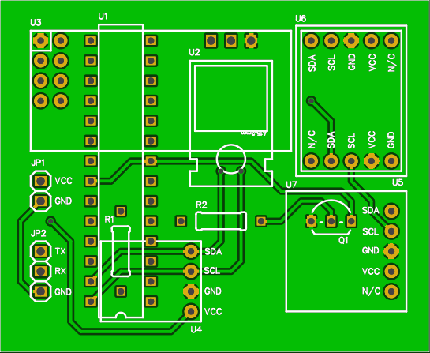
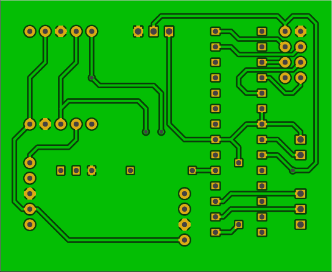

Wireless sensor module
======================

This directory contains schematic and PCB design for single wireless sensor module in [EAGLE](https://cadsoft.io/) 
format. Board design is also available on [EasyEDA](https://easyeda.com/maciej/sensors-387a7c4150d841bbb06d5350ea664e67).  

**Features**:
 * small dimensions - 55x45 mm
 * low power consumption - ~40mA during measurement and ~40µA (0.04mA) in standby
 * supports standard BMP180, HTU21D and TSL2561 breakout boards - min. one is required, but all can be installed at same time 
 * input voltage from 3 to 5.5V 
 * low cost
 

Part list
---------

| PCB ID | Part name            | Qty | Description                     |
|--------|----------------------|-----|---------------------------------|
| U1     | ATmega328P (DIL28)   |  1  | microcontroller                 |
| U2     | LD117AV33 (TO220)    |  1  | voltage regulator               |
| U3     | NRF24L01+            |  1  | radio module                    |
| U4     | HTU21D (breakboard)  |  1  | temperature and humidity sensor | 
| U5/U6* | TSL2561 (breakboard) |  1  | luminescence sensor             | 
| U7     | BMP180 (breakboard)  |  1  | barometer sensor                |
| R1, R2 | resistor 10k         |  2  | resistor                        |
| Q1     | BC337-40             |  1  | NPN transistor                  | 
|        | pinhead 1x2          |  1  | pin header connector            | 
|        | pinhead 1x3          |  1  | pin header connector            | 
|        | pinhead 1x4          |  1  | pin header connector            | 
|        | pinhead 2x4          |  1  | pin header connector            | 
|        | pinhead 1x5          |  3  | pin header connector            | 
|        | DIL28 socket         |  1  | socket for ATmega328P           | 

*) There are two TSL2561 connectors (with different pin order) on the board, 
   but only one TSL2561 can be used at same time. 
 
Top layer
---------

 
Bottom layer
------------

