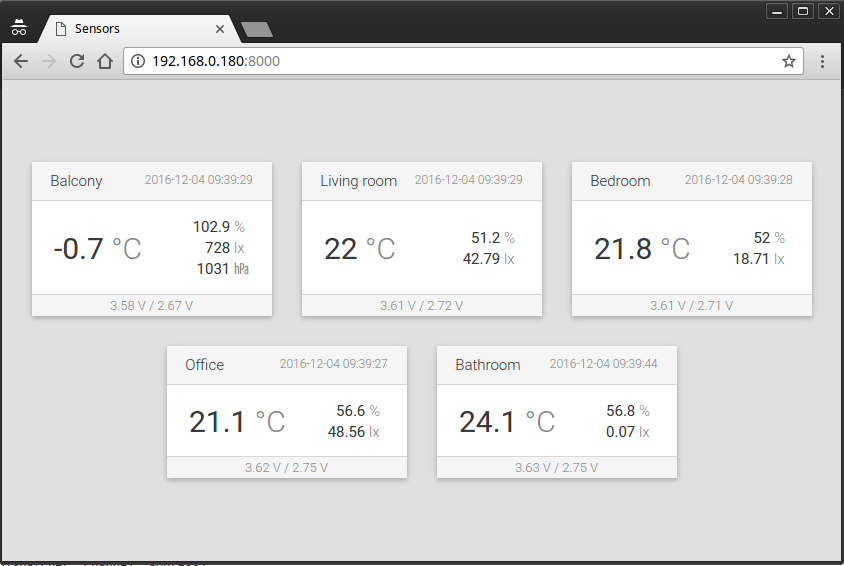

Example server
--------------

This is example of server that listens for readings send by wireless modules.

**Hardware requirements**

* Raspberry PI with enabled SPI
* NRF24L01+ radio module connected to Raspberry PI
* at least one [wireless sensor module](../board) with proper [firmware](../firmware)

**Software requirements**

* Python 3
* `spidev` package 
* [pyNRF](https://github.com/nettigo/pyNRF)
* [Tornado Web Server](http://www.tornadoweb.org/en/stable/)
* NodeJS and NPM to modify frontend JS files

**Running the example**
1. clone or download this repository
2. edit [`server.py`](./server.py) and set:
 * radio channel (same as option 1 in wireless module setup)
 * radio address (same as option 3 in wireless module setup)
 * your sensor names (key is sensor's ID from option I and value is name that will be displayed for the sensor)
  
3. run `python3 server.py` in `example-server` directory
4. open in a browser `http://your-raspberry-pi-ip:8000`

If everything works, you should see readings from your wireless sensors:
  

Readings on a web page will be updated (thought WebSocket) as soon as new reading will be received by the server.
  

**Modifying the example**

Example consists of:

* [`server.py`](./server.py) - main file of the server
* [`backand`](./backend) - classes used by the server
* [`frontend`](./frontend) - source JS files of frontend application compiled to `static/app.js` (ES6, React)
* [`static`](./static) - static files used by frontend application (HTML, CSS)

Everything except files in [`frontend`](./frontend) can be modified directly. [`frontend`](./frontend) contains 
ES6 and JSX files, so they must be compiled after modification.
 
Before first compilation, you must install dependencies with `npm install`, than you are able to run:

* `npm run build` to compile frontend files once
* `npm run watch` to continuously compile frontend files after each modification. 